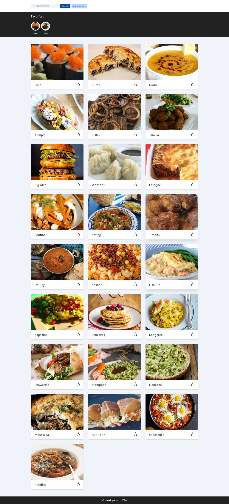

### 

# :closed_book: Meals Application

### _Meals Application using react !!_

### Link :link: https://rak-meals.netlify.app/

## Interface

## Run Locally

  - Run This command `https://github.com/developer-rak/meals_application.git`
  - You are now in the dev environment and you can play around

## ✨ Features

  - Search your fav meal
  - surprize button to get serprize
  - add your fav meal

## ⚙️ Tech Stack
  - HTML5
  - CSS
  - React
  - axios
  - Netlify
